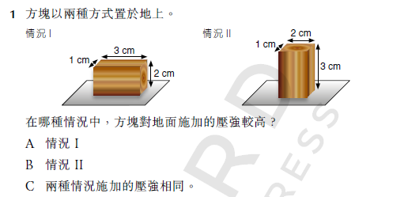

# DSE 物理 第5章 氣體 溫習筆記

# DSE 物理 第5章 氣體 溫習筆記

適用：香港DSE Physics | 來源：課本DSEPHY_TE_105_ce_unlocked

---

## 5.1 氣體定律

### 一、壓強

1. **定義**
    
    $$
    p=\frac{F}{A}
    $$
    
- 壓強 = 垂直作用力 / 接觸面積
1. **單位**
- 帕斯卡（Pa）
- $1\ \text{Pa}=1\ \text{N m}^{-2}$
1. **重點**
- 力相同時，面積越小 → 壓強越大（針戳氣球、高跟鞋）

---

### 二、氣體壓強

1. **大氣壓強**
- 海平面約：$100\ \text{kPa}=1\ \text{atm}$
- 高度越高 → 大氣壓越低

1. **量度儀器**
- 布爾登氣壓計（Bourdon gauge）
- 壓強感應器

---

### 三、三大氣體定律（必考）

### 1. 波義耳定律 Boyle’s Law

- **條件**：固定質量、**溫度 T 不變**
- **關係**：壓強 與 體積 成**反比**
- **公式**
    
    $$
    p_1 V_1 = p_2 V_2
    $$
    
    
    
- **圖像**
    - $p-V$：曲線
    - $p-\dfrac{1}{V}$：過原點直線

### 2. 氣壓定律 Pressure Law

- **條件**：固定質量、**體積 V 不變**
- **關係**：壓強 與 **開氏溫度 T** 成正比
- **公式**
    
    $$
    \frac{p_1}{T_1}=\frac{p_2}{T_2}
    $$
    
    
    
    
    
    
    
    
    

### 3. 查理定律 Charles’s Law

- **條件**：固定質量、**壓強 p 不變**
- **關係**：體積 與 **開氏溫度 T** 成正比
- **公式**
    
    $$
    \frac{V_1}{T_1}=\frac{V_2}{T_2}
    $$
    

---

### 四、溫標轉換（必背）

- 開氏溫標（絕對溫標）：
    
    $$
    T(\text{K})=T(^\circ\text{C})+273
    $$
    
- 絕對零度：$0\ \text{K}=-273\ ^\circ\text{C}$
- $1\ \text{K}$ 溫差 = $1\ ^\circ\text{C}$ 溫差

---

### 五、普適氣體定律（理想氣體定律）

1. **合併公式（固定質量）**
    
    $$
    \frac{p_1 V_1}{T_1}=\frac{p_2 V_2}{T_2}
    $$
    
2. **完整公式**
    
    $$
    pV = nRT
    $$
    
- $p$：壓強（Pa）
- $V$：體積（$\text{m}^3$）
- $n$：摩爾數（mol）
- $R=8.31\ \text{J mol}^{-1}\text{K}^{-1}$
- $T$：開氏溫度（K）
1. **分子數目 N**
    
    $$
    N = n N_A
    $$
    
- $N_A=6.02×10^{23}\ \text{mol}^{-1}$
1. **理想氣體條件**
- 高溫、低壓 → 真實氣體 ≈ 理想氣體

---

## 5.2 氣體分子運動論

### 一、核心概念

1. 氣體壓強來自：**分子撞擊容器內壁**
2. 溫度越高 → 分子平均動能越大、速率越快

---

### 二、用分子運動論解釋定律

1. **波義耳定律（T 不變）**
- 體積 ↓ → 分子撞擊頻率 ↑ → 壓強 ↑

1. **氣壓定律（V 不變）**
- 溫度 ↑ → 分子速率 ↑、撞擊更猛烈 → 壓強 ↑

1. **查理定律（p 不變）**
- 溫度 ↑ → 分子速率 ↑ → 需增大體積維持壓強不變

---

### 三、理想氣體 7 大假定（DSE 常考）

1. 所有分子完全相同、質量相同
2. 分子持續**隨機運動**
3. 分子數目極多
4. 分子體積可忽略
5. 碰撞時間可忽略
6. 碰撞為**完全彈性碰撞**
7. 分子間作用力可忽略

---

### 四、微觀公式（計算專用）

1. 壓強與分子運動
    
    $$
    pV=\frac{1}{3}Nm\overline{c^2}
    $$
    
    
    
    
    
2. 分子平均動能
    
    $$
    KE_{\text{平均}}=\frac{3RT}{2N_A}\propto T
    $$
    
    
    
3. 方均根速率
    
    $$
    c_{\text{rms}}=\sqrt{\frac{3RT}{mN_A}}
    $$
    
    
    
4. 氣體總動能（= 內能，理想氣體無勢能）
    
    $$
    E_K=\frac{3}{2}nRT
    $$
    
    氣體內能 = PE + KE = 0 (因為沒有change of state)+ KE
    

---

## 必考陷阱與計算提醒

1. **所有氣體定律計算必須用開氏溫度（K）**
2. 單位統一：$p$→Pa、$V$→$\text{m}^3$、$T$→K
3. 波義耳定律：前後單位一致即可計算
4. 絕對零度是所有氣體 $p-T$、$V-T$ 圖的共同截距，不會改變

---

## 速記口訣

- 溫不變 → 波義耳：$p$ 與 $V$ 反比
- 體不變 → 氣壓律：$p$ 與 $T$ 正比
- 壓不變 → 查理律：$V$ 與 $T$ 正比
- 計算先轉 K，單位要統一